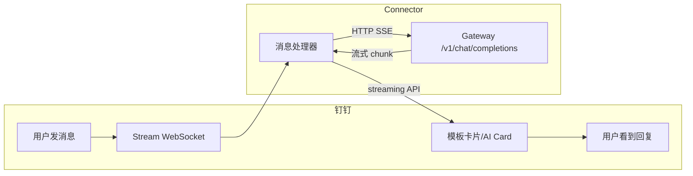

# DingTalk OpenClaw Connector

将钉钉机器人连接到 [OpenClaw](https://openclaw.ai) Gateway，支持 AI Card 流式响应和模板卡片。

## 特性

- ✅ **模板卡片** - 支持自定义模板样式，markdown 内容渲染
- ✅ **AI Card 流式响应** - 打字机效果，实时显示 AI 回复
- ✅ **会话持久化** - 同一用户的多轮对话共享上下文
- ✅ **超时自动新会话** - 默认 30 分钟无活动自动开启新对话
- ✅ **手动新会话** - 发送 `/new` 或 `新会话` 清空对话历史
- ✅ **图片自动上传** - 本地图片路径自动上传到钉钉
- ✅ **主动发送消息** - 支持主动给钉钉个人或群发送消息

## 架构



## 效果

### 模板卡片效果


### AI Card 效果


## 安装

### 1. 安装插件

```bash
# 远程安装
openclaw plugins install https://github.com/yetio/dingtalk-openclaw-connector.git

# 升级插件
openclaw plugins update dingtalk-connector

# 或本地开发模式
git clone https://github.com/yetio/dingtalk-openclaw-connector.git
cd dingtalk-openclaw-connector
npm install
openclaw plugins install -l .
```

### 2. 配置

在 `~/.openclaw/openclaw.json` 中添加：

```json5
{
  "channels": {
    "dingtalk-connector": {
      "enabled": true,
      "clientId": "dingxxxxxxxxx",           // 钉钉 AppKey
      "clientSecret": "your_secret_here",   // 钉钉 AppSecret
      "cardTemplateId": "your_template_id", // 可选：模板卡片 ID（.schema 结尾）
      "gatewayToken": "",                   // 可选：Gateway 认证 token
      "gatewayPassword": "",                // 可选：Gateway 认证 password
      "sessionTimeout": 1800000             // 可选：会话超时(ms)，默认 30 分钟
    }
  },
  "gateway": {
    "http": {
      "endpoints": {
        "chatCompletions": {
          "enabled": true
        }
      }
    }
  }
}
```

**模板卡片配置说明：**
- `cardTemplateId`：可选，配置后消息将使用模板卡片发送
- 模板需要提前在钉钉开放平台创建，模板中需要有一个 `content` 变量用于显示消息内容
- 如果不配置 `cardTemplateId`，将使用 AI Card

### 3. 重启 Gateway

```bash
openclaw gateway restart
```

验证：

```bash
openclaw plugins list  # 确认 dingtalk-connector 已加载
```

## 创建钉钉机器人

1. 打开 [钉钉开放平台](https://open.dingtalk.com/)
2. 进入 **应用开发** → **企业内部开发** → 创建应用
3. 添加 **机器人** 能力，消息接收模式选择 **Stream 模式**
4. 开通权限：
   - `Card.Streaming.Write`
   - `Card.Instance.Write`
   - `qyapi_robot_sendmsg`
5. **发布应用**，记录 **AppKey** 和 **AppSecret**

## 创建模板卡片（可选）

1. 在钉钉开放平台进入 **卡片平台** → 创建卡片
2. 设计卡片模板，添加一个 `content` 变量（用于显示消息内容）
3. 发布卡片，获取模板 ID（格式：`xxxxxxxx-xxxx-xxxx-xxxx-xxxxxxxxxxxx.schema`）
4. 将模板 ID 配置到 `cardTemplateId` 配置项

## 配置参考

| 配置项 | 环境变量 | 说明 |
|--------|----------|------|
| `clientId` | `DINGTALK_CLIENT_ID` | 钉钉 AppKey |
| `clientSecret` | `DINGTALK_CLIENT_SECRET` | 钉钉 AppSecret |
| `cardTemplateId` | `DINGTALK_CARD_TEMPLATE_ID` | 模板卡片 ID（可选） |
| `gatewayToken` | `OPENCLAW_GATEWAY_TOKEN` | Gateway 认证 token（可选） |
| `gatewayPassword` | — | Gateway 认证 password（可选，与 token 二选一） |
| `sessionTimeout` | — | 会话超时时间，单位毫秒（默认 1800000 = 30分钟） |
| `enableMediaUpload` | — | 是否启用图片自动上传（默认 true） |
| `systemPrompt` | — | 自定义 system prompt |

## 消息发送优先级

1. **模板卡片**（如果配置了 `cardTemplateId`）
2. **AI Card**
3. **普通消息**

## 会话命令

用户可以发送以下命令开启新会话（清空对话历史）：

- `/new`、`/reset`、`/clear`
- `新会话`、`重新开始`、`清空对话`

## 项目结构

```
dingtalk-openclaw-connector/
├── plugin.ts              # 插件入口
├── openclaw.plugin.json   # 插件清单
├── package.json           # npm 依赖
└── LICENSE
```

## 常见问题

### Q: 出现 405 错误

需要在 `~/.openclaw/openclaw.json` 中启用 chatCompletions 端点：

```json5
{
  "gateway": {
    "http": {
      "endpoints": {
        "chatCompletions": {
          "enabled": true
        }
      }
    }
  }
}
```

### Q: 出现 401 错误

检查 `~/.openclaw/openclaw.json` 中的 gateway.auth 鉴权的 token/password 是否正确。

### Q: 钉钉机器人无响应

1. 确认 Gateway 正在运行：`curl http://127.0.0.1:18789/health`
2. 确认机器人配置为 **Stream 模式**（非 Webhook）
3. 确认 AppKey/AppSecret 正确

### Q: 模板卡片不显示内容

1. 确认模板中有一个 `content` 变量
2. 确认模板已发布
3. 检查日志中的 `cardTemplateId` 配置是否正确

### Q: AI Card 不显示，只有纯文本

需要开通权限 `Card.Streaming.Write` 和 `Card.Instance.Write`，并重新发布应用。

### Q: 图片不显示

1. 确认 `enableMediaUpload: true`（默认开启）
2. 检查日志 `[DingTalk][Media]` 相关输出
3. 确认钉钉应用有图片上传权限

## License

[MIT](LICENSE)
